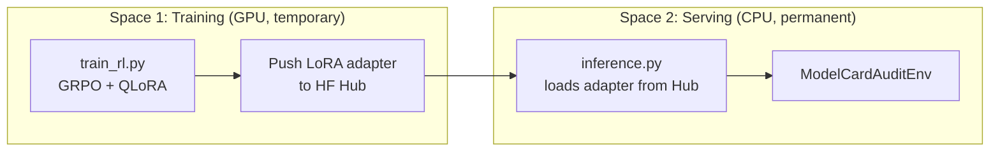
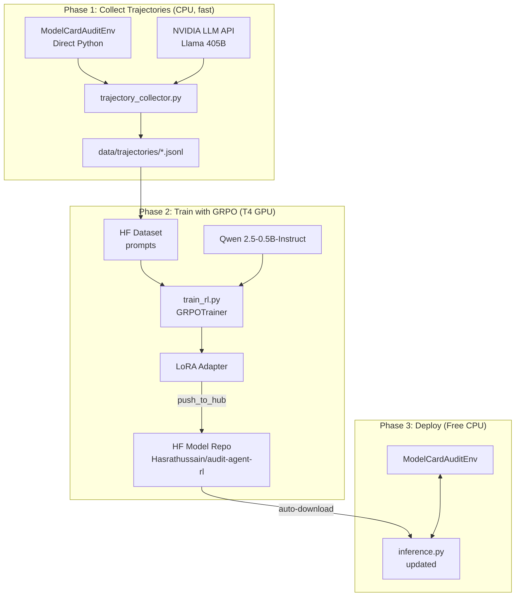

# True Reinforcement Learning Training Loop for ModelCardAuditEnv

## Goal

Transform the current stateless, deterministic baseline agent in `inference.py` into a **self-improving RL agent** that permanently learns from its mistakes. The trained model **replaces** the deterministic baseline entirely. The entire pipeline — environment, training, and deployment — runs on **HuggingFace Spaces** using paid GPU hardware within a **$20 budget**.

---

## Budget & Hardware Plan

| Resource | Option | Cost | Runtime |
|----------|--------|------|---------|
| **Training GPU** | HF Spaces — Nvidia T4 small | $0.40/hr | ~6-8 hrs ≈ **$3.20** |
| **Training GPU (alt)** | HF Spaces — Nvidia A10G small | $1.00/hr | ~3-4 hrs ≈ **$4.00** |
| **Serving (existing)** | HF Spaces — Free CPU (current) | $0.00 | ∞ |
| **Total estimated** | | | **$3-5** of $20 |

### Strategy: Two-Space Architecture



1. **Space 1 — Trainer** (temporary, GPU-enabled): A separate HF Space (or the same Space temporarily upgraded to T4 GPU) that runs the GRPO training script. Once training finishes, it pushes the LoRA adapter to a HuggingFace Model repo and the Space is downgraded back to free CPU / paused.
2. **Space 2 — Server** (permanent, free CPU): Your existing `Hasrathussain/ModelCardAudit-Env` Space continues serving the API + frontend. The updated `inference.py` loads the fine-tuned LoRA adapter from the Hub at startup and uses it for all auditing tasks.

> [!TIP]
> **Cost control**: The T4 GPU bills per-minute. Training Qwen 2.5-0.5B with QLoRA on your 9 model cards for ~50 epochs should take 2-4 hours on T4 = **$0.80-$1.60**. You can retrain multiple times within $20.

---

## Architecture Overview



### Why GRPO over PPO?

| Factor | PPO | GRPO |
|--------|-----|------|
| Requires critic model | ✅ (4 models in VRAM) | ❌ (2 models) |
| VRAM on T4 (16GB) | Won't fit 0.5B | ✅ Fits 0.5B with QLoRA |
| Implementation complexity | High | Moderate |
| TRL support | `PPOTrainer` | `GRPOTrainer` |

### Base Model: `Qwen/Qwen2.5-0.5B-Instruct`

- **0.5B parameters** — fits comfortably in T4's 16GB VRAM with QLoRA (4-bit = ~0.3GB base + LoRA + optimizer)
- Strong instruction following out of the box
- Fast generation during GRPO rollouts (critical since GRPO generates G completions per prompt)
- **CPU inference feasible** — the production Space can run the 0.5B model on free CPU hardware without GPU

---

## Proposed Changes

### Component 1: Gymnasium Wrapper

#### [NEW] [gym_wrapper.py](file:///d:/Projects/Scaler%20Round%201%20Project/env/gym_wrapper.py)

Wraps `ModelCardAuditEnv` in a standard `gymnasium.Env` text-based interface:

- `reset(task_id)` → returns formatted observation string
- `step(action_json_str)` → `(obs_str, reward_float, terminated, truncated, info)`
- Converts between JSON strings (what the LLM produces) and `Action` Pydantic objects
- Handles episode lifecycle (done flag, max steps → truncation)
- Exposes `gymnasium.spaces.Text` for both observation and action spaces
- Iterates across all model cards deterministically (no randomness during training for reproducibility)

---

### Component 2: Trajectory Collector

#### [NEW] [trajectory_collector.py](file:///d:/Projects/Scaler%20Round%201%20Project/trajectory_collector.py)

Uses the existing NVIDIA API (Llama 405B) to generate expert-quality trajectories:

- Runs the LLM through the environment **directly** (no HTTP server needed) for fast collection
- For each episode:
  1. `env.reset(task_id)` → initial observation
  2. LLM generates action from observation + system prompt
  3. `env.step(action)` → next observation, reward, done
  4. Saves: `{"prompt": system+obs, "completion": action_json, "reward": float, "task_id": str, "step": int, "episode_id": str}`
- Collects across all 3 difficulties × all 3 model cards = 9 base episodes
- Supports `--num_rollouts N` for repeated runs per card
- Outputs JSONL to `data/trajectories/`
- Can run locally on CPU (only needs API access, no GPU)

**CLI**:
```bash
python trajectory_collector.py --num_rollouts 5 --output data/trajectories/rollouts.jsonl
```

---

### Component 3: GRPO Training Script

#### [NEW] [train_rl.py](file:///d:/Projects/Scaler%20Round%201%20Project/train_rl.py)

The core RL training loop. Designed to run on a **HF Spaces T4 GPU**.

**How it works:**

```python
from trl import GRPOTrainer, GRPOConfig
from peft import LoraConfig
from transformers import AutoModelForCausalLM, AutoTokenizer

# 1. Load base model with QLoRA (4-bit quantization)
model = AutoModelForCausalLM.from_pretrained(
    "Qwen/Qwen2.5-0.5B-Instruct",
    quantization_config=BitsAndBytesConfig(load_in_4bit=True, ...),
)
peft_config = LoraConfig(r=16, lora_alpha=32, target_modules=["q_proj", "v_proj", ...])

# 2. Load prompts dataset (from collected trajectories)
dataset = load_prompts_from_trajectories("data/trajectories/")

# 3. Define the environment-backed reward function
def audit_reward_fn(prompts, completions, **kwargs):
    """
    For each completion, parse it as a JSON action, step the environment,
    and return the environment's reward signal.
    """
    rewards = []
    for prompt, completion in zip(prompts, completions):
        # Parse the LLM's output as an action
        action = parse_action(completion)
        # Step the environment
        obs, reward, done, info = env.step(action)
        # Use the graded score if episode is done, otherwise step reward
        if done:
            rewards.append(info.get("score", reward.total) * 10.0)  # scale up
        else:
            rewards.append(reward.total)
    return rewards

# 4. Configure GRPO
config = GRPOConfig(
    output_dir="models/audit-agent-rl",
    num_train_epochs=3,
    per_device_train_batch_size=4,
    num_generations=4,           # G=4 completions per prompt
    max_completion_length=256,   # JSON actions are short
    max_prompt_length=2048,      # observations can be long
    learning_rate=5e-5,
    beta=0.04,                   # KL coefficient
    logging_steps=1,
    save_strategy="epoch",
    push_to_hub=True,
    hub_model_id="Hasrathussain/audit-agent-rl",
)

# 5. Train
trainer = GRPOTrainer(
    model=model,
    reward_funcs=audit_reward_fn,
    args=config,
    train_dataset=dataset,
    peft_config=peft_config,
)
trainer.train()
trainer.push_to_hub()  # Saves LoRA adapter to HF Hub
```

**Key Design Decisions:**
- **QLoRA (4-bit + LoRA r=16)** keeps VRAM under 10GB on T4
- **G=4** generations balances diversity vs compute cost
- **β=0.04** KL penalty prevents forgetting language abilities
- **Curriculum**: Loads prompts from easy → medium → hard tasks in order
- **Environment-in-the-loop**: The reward function directly calls the `ModelCardAuditEnv` (no HTTP) — each completion is evaluated by the actual grading rubric
- **`push_to_hub=True`**: Automatically uploads the trained LoRA adapter to `Hasrathussain/audit-agent-rl` on HF Hub

**CLI:**
```bash
# On the T4 GPU Space:
python train_rl.py \
  --base_model Qwen/Qwen2.5-0.5B-Instruct \
  --epochs 3 \
  --push_to_hub \
  --hub_model_id Hasrathussain/audit-agent-rl
```

---

### Component 4: Replace `inference.py` with RL Agent

#### [MODIFY] [inference.py](file:///d:/Projects/Scaler%20Round%201%20Project/inference.py)

The deterministic baseline is **replaced** with the RL-trained model. The updated script:

1. **At startup**: Downloads the LoRA adapter from `Hasrathussain/audit-agent-rl` on HF Hub
2. **Loads the base model + adapter** using `transformers` + `peft` (CPU-compatible for free Spaces)
3. **Runs the LLM agent loop**:
   - Receives observation from environment
   - Formats it into a prompt (reusing existing `format_observation()`)
   - Generates action using the fine-tuned model
   - Parses JSON action → steps the environment
   - Repeats until done
4. **Emits the same `[START]`/`[STEP]`/`[END]` validator events** for full compatibility with the existing evaluation pipeline
5. **Fallback**: If the LoRA adapter is not found on Hub (first run before training), falls back to the existing deterministic logic with a warning

**Key changes to existing `inference.py`:**

```diff
 # New imports
+from transformers import AutoModelForCausalLM, AutoTokenizer
+from peft import PeftModel

 # New: Load the fine-tuned model
+def load_rl_agent():
+    """Load the GRPO-trained model from HF Hub."""
+    try:
+        tokenizer = AutoTokenizer.from_pretrained("Qwen/Qwen2.5-0.5B-Instruct")
+        model = AutoModelForCausalLM.from_pretrained("Qwen/Qwen2.5-0.5B-Instruct")
+        model = PeftModel.from_pretrained(model, "Hasrathussain/audit-agent-rl")
+        model.eval()
+        return model, tokenizer
+    except Exception:
+        return None, None

 # Replace run_task_deterministic with run_task_rl
-def run_task_deterministic(task_id, client=None):
+def run_task(task_id, model=None, tokenizer=None):
+    # If RL model available: use it for every action
+    # If not: fall back to deterministic baseline (existing code)
```

The existing deterministic logic (MEDIUM_FINDINGS, HARD_FINDINGS, etc.) stays as the fallback path but is no longer the primary agent.

---

### Component 5: Training Dockerfile

#### [NEW] [Dockerfile.train](file:///d:/Projects/Scaler%20Round%201%20Project/Dockerfile.train)

A separate Dockerfile for the training Space:

```dockerfile
FROM python:3.11-slim
WORKDIR /app

# Install PyTorch (CPU for setup, GPU available at runtime on HF Spaces)
RUN pip install --no-cache-dir torch --index-url https://download.pytorch.org/whl/cu121

COPY requirements.txt .
RUN pip install --no-cache-dir -r requirements.txt
RUN pip install --no-cache-dir trl>=0.16.0 transformers>=4.48.0 \
    datasets>=3.2.0 accelerate>=1.3.0 peft>=0.14.0 \
    bitsandbytes>=0.45.0 gymnasium>=1.0.0 huggingface_hub

COPY . .

# Training entry point
CMD ["python", "train_rl.py", "--push_to_hub"]
```

---

### Component 6: Serving Dockerfile Update

#### [MODIFY] [Dockerfile](file:///d:/Projects/Scaler%20Round%201%20Project/Dockerfile)

Update the existing production Dockerfile to include `transformers` and `peft` for loading the RL agent at inference time:

```diff
 FROM python:3.11-slim
 WORKDIR /app
 COPY requirements.txt .
 RUN pip install --no-cache-dir -r requirements.txt
+# RL inference dependencies (CPU-only, no torch GPU needed)
+RUN pip install --no-cache-dir transformers peft huggingface_hub \
+    torch --index-url https://download.pytorch.org/whl/cpu
```

---

### Component 7: Updated Dependencies

#### [MODIFY] [requirements.txt](file:///d:/Projects/Scaler%20Round%201%20Project/requirements.txt)

```diff
 fastapi>=0.111.0
 uvicorn>=0.30.0
 pydantic>=2.8.0
 openai>=1.35.0
 requests>=2.32.0
 pytest>=8.0.0
 openenv-core>=0.2.0
+# RL agent inference (CPU-compatible)
+transformers>=4.48.0
+peft>=0.14.0
+huggingface_hub>=0.28.0
```

#### [MODIFY] [pyproject.toml](file:///d:/Projects/Scaler%20Round%201%20Project/pyproject.toml)

Add RL training as an optional dependency group + new script entry points:

```diff
 [project.optional-dependencies]
 dev = [
     "pytest>=8.0.0",
 ]
+rl-train = [
+    "trl>=0.16.0",
+    "transformers>=4.48.0",
+    "datasets>=3.2.0",
+    "accelerate>=1.3.0",
+    "peft>=0.14.0",
+    "bitsandbytes>=0.45.0",
+    "torch>=2.5.0",
+    "gymnasium>=1.0.0",
+]

 [project.scripts]
 modelcard-audit-env = "server.app:main"
 serve = "server.app:main"
 server = "server.app:main"
+collect-trajectories = "trajectory_collector:main"
+train-rl = "train_rl:main"
```

#### [MODIFY] [.gitignore](file:///d:/Projects/Scaler%20Round%201%20Project/.gitignore)

```diff
+# RL Training Artifacts
+models/
+logs/rl_training/
+data/trajectories/
```

---

### Component 8: Documentation

#### [MODIFY] [README.md](file:///d:/Projects/Scaler%20Round%201%20Project/README.md)

Add a new "🧠 RL Training" section documenting the full workflow:

```markdown
## 🧠 RL Training (True Self-Improvement)

This environment supports training an RL agent that permanently learns
from its auditing mistakes using GRPO (Group Relative Policy Optimization).

### Quick Start

# Step 1: Collect expert trajectories (runs on CPU, uses NVIDIA API)
python trajectory_collector.py --num_rollouts 5

# Step 2: Train on HuggingFace Spaces T4 GPU (~$1-2)
python train_rl.py --push_to_hub --hub_model_id Hasrathussain/audit-agent-rl

# Step 3: The updated inference.py auto-loads the trained model
python inference.py
```

---

## File Summary

| File | Status | Purpose | Runs On |
|------|--------|---------|---------|
| `env/gym_wrapper.py` | NEW | Gymnasium-compatible wrapper | CPU |
| `trajectory_collector.py` | NEW | Collect (obs, action, reward) logs via LLM API | CPU + API |
| `train_rl.py` | NEW | GRPO training with TRL + QLoRA | T4 GPU ($0.40/hr) |
| `Dockerfile.train` | NEW | Docker image for training Space | HF Spaces GPU |
| `inference.py` | MODIFY | Replace deterministic → RL agent + fallback | CPU (free) |
| `Dockerfile` | MODIFY | Add transformers/peft for inference | HF Spaces CPU |
| `requirements.txt` | MODIFY | Add inference deps | — |
| `pyproject.toml` | MODIFY | Add rl-train optional deps + scripts | — |
| `.gitignore` | MODIFY | Exclude large RL artifacts | — |
| `README.md` | MODIFY | Document RL workflow | — |

---

## Execution Workflow

### Phase 1: Collect Trajectories (Local, CPU, ~10 min)
```bash
# Uses your existing NVIDIA API key (Llama 405B) to generate expert audit traces
python trajectory_collector.py --num_rollouts 5 --output data/trajectories/expert.jsonl
```
**Cost**: Free (uses existing NVIDIA API credits)

### Phase 2: Train with GRPO (HF Spaces T4, ~2-4 hrs)
```bash
# Option A: Upgrade existing Space to T4 temporarily
# Option B: Create a new training Space with Dockerfile.train

python train_rl.py \
  --base_model Qwen/Qwen2.5-0.5B-Instruct \
  --trajectories data/trajectories/expert.jsonl \
  --epochs 3 \
  --push_to_hub \
  --hub_model_id Hasrathussain/audit-agent-rl
```
**Cost**: ~$0.80-$1.60 (T4 @ $0.40/hr × 2-4 hrs)

### Phase 3: Deploy (Existing Space, Free CPU)
```bash
# Just restart the existing Space — inference.py auto-downloads the adapter
# No code changes needed after initial deployment
```
**Cost**: $0.00

### Phase 4: Iterate (repeat Phase 1-2)
Each re-training cycle costs ~$1. With $20 you can iterate **12-15 times**, progressively improving the agent.

---

## Verification Plan

### Automated Tests

```bash
# 1. Test gym wrapper
python -c "from env.gym_wrapper import ModelCardAuditGymEnv; e = ModelCardAuditGymEnv(); obs, info = e.reset(); print('OK:', type(obs), len(obs))"

# 2. Collect 1 trajectory (smoke test)
python trajectory_collector.py --num_rollouts 1 --task basic_completeness

# 3. Training smoke test (on GPU)
python train_rl.py --max_steps 2 --base_model Qwen/Qwen2.5-0.5B-Instruct --no_push

# 4. Inference with trained model
python inference.py  # Should auto-download from Hub and run RL agent
```

### Manual Verification
- Compare scores: deterministic baseline vs RL agent after each training iteration
- Inspect reward curves — should trend upward across epochs
- Verify agent stops making false positive flags (the main failure mode)
- Check that the fine-tuned model generates valid JSON actions (not gibberish)
- Confirm the free CPU Space can load and run the 0.5B model at acceptable speed (~5-15 sec/step)
